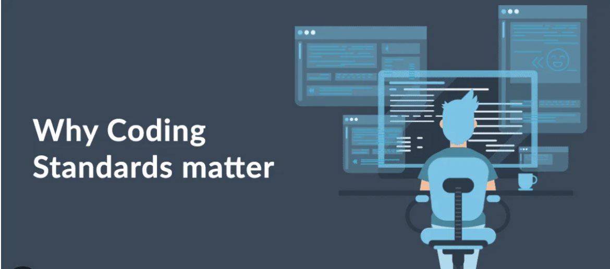

## Introduction

Imagine trying to travel through a dense jungle without a map or compass. You will most likely get lost. This is similar to being in the complex world of software development without coding standards. Coding standards don't just tell you what characters should be placed where, they are our compass in the complex world of programming. Coding standards ensure the quality and clarity of the programs we write. In what follows, I’ll explore the nature of coding standards and use my own example to illustrate the transformative impact it has had on my approach to software development and learning.

## The Nature of Coding Standards

Coding standards are similar to the syntax rules of a programming language. Just as syntax enables clear communication in written language, coding standards ensure that code is understandable, maintainable, and scalable. For example, if you work in a software development company, you must hope that the code written by the colleagues you work with can be understood by you. This will greatly improve the efficiency of your work, and you don't have to worry about spending a lot of time trying to understand other people's intentions. Coding standards serve this purpose. This is very evident in projects where teams work together to develop applications. If a codebase is cluttered with inconsistent naming and varied error-handling practices, it will make it difficult for team members to contribute effectively. But when everyone follows the rules of coding standards, the code becomes more unified and self-explanatory, which significantly increases our development speed and reduces code review time.

## Real-Life Example: The Google Java Style Guide

Take Google, for example, which manages one of the largest code bases in the world. The Google Java Style Guide isn't just about whether to use tabs or spaces for indentation; It covers naming conventions, file structures, programming practices, and more. This comprehensive approach ensures that all developers, regardless of background or experience level, can write code in a way that is consistent and understandable to others within the organization. It's like making sure every builder uses the same blueprints to build each part of a skyscraper - it's critical to the overall success of the project.

## Learning Through Standards: A Personal Narrative

Adopting ESLint in IntelliJ IDEA is similar to learning to navigate with a map and compass. Initially, the tool acts like a strict teacher, marking every deviation from the path. However, it quickly became a trusted guide to writing better, cleaner code. When I first introduced ESLint into my development workflow, the number of warnings and errors was overwhelming. However, as I continued to solve the problems highlighted by ESLint, I gradually noticed a pattern. Sections of code that conform to the ESLint standard are not only cleaner, but also less prone to bugs. Sometimes, when I write many lines of code to try to accomplish a goal, ESLint will prompt me for a simpler way. Often these many lines of code can be achieved in one line. This makes my program look cleaner and easier to understand.

## Conclusion

Coding standards might seem like a small piece of the software development puzzle, but their impact is profound. Through my own experiences with ESLint and IntelliJ, I've come to see them as essential tools for quality, learning, and teamwork. They're not just about making code look pretty; they're about making it robust, maintainable, and above all, understandable. As we continue to navigate the complex world of software development, let's not underestimate the power of these unsung heroes. Embrace them, and watch as they transform not just your code, but your approach to development itself.
