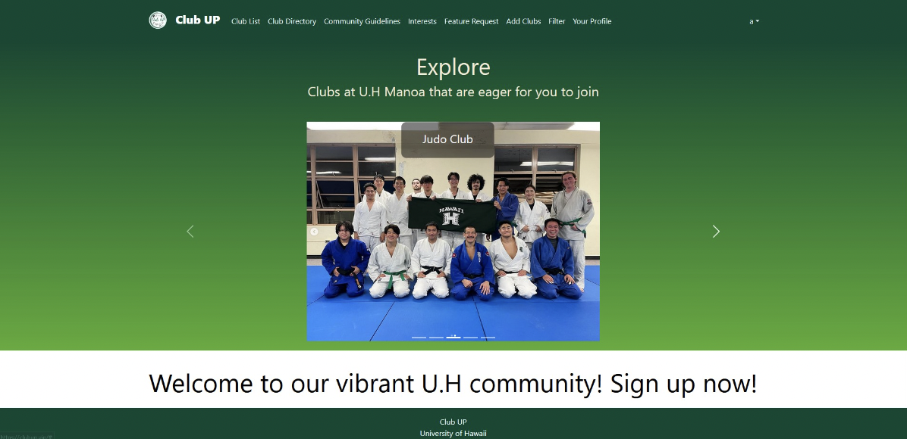

## Project Overview:
The University of Hawaii at Manoa is vibrant with over 200 Registered Independent Organizations, alongside numerous informal groups. Prior to Club Up, there was no centralized system for students to explore, discover, and engage with these clubs. Our application, Club Up, bridges this gap by providing a comprehensive directory of student clubs, complete with detailed profiles, meeting times, locations, and contact information.

## My Role:
As a member of the Club Up development team, I focused on implementing robust access management features within the application. My contributions included:

Admin Role Implementation: I designed and developed the administrative functionalities that allow designated users to manage club information and user permissions effectively.
Access Controls: I established secure access controls that ensure users can only view or modify information pertinent to their roles, enhancing both the security and usability of the application.

## Technologies Used:
Meteor: Leveraged for full-stack JavaScript execution, facilitating seamless client-server integration.
React: Employed to build a dynamic, component-based user interface, enhancing user experience with interactive elements.
React Bootstrap and Semantic UI: Utilized for responsive design, ensuring a consistent and intuitive layout across various devices.
Uniforms: Integrated with React for streamlined form handling, making data entry and validation straightforward and efficient.

## Learning Outcomes:
Through my work on Club Up, I gained valuable insights into:

Building and managing user roles within a web application.
Designing effective access control mechanisms to safeguard user data.
Collaborating within a team to merge different aspects of a complex system into a cohesive product.

## Explore More:
Interested in the technical details or wish to contribute? Visit our ["GitHub repository"](https://github.com/orgs/clubmeetup/repositories)).
