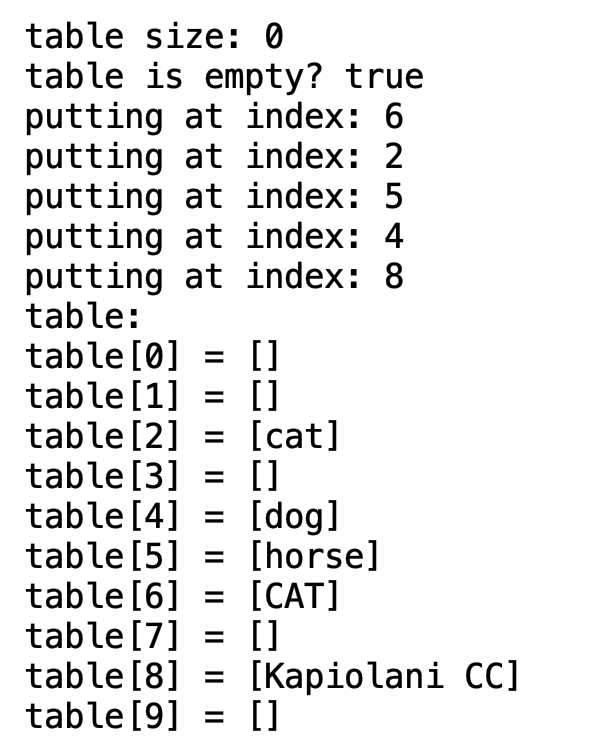

  

## About the Project:
I worked on a project where I built YiruiwHashTable<T>, a special kind of table in a computer program that can store lots of different items. It's like a big set of boxes where each box can hold a list of things. This table is really good at finding and keeping track of these items quickly, even if there are lots and lots of them.

## My Role:
I did everything for this project by myself. My main job was to write the code that made this table work. I made sure that it could hold any type of item and that it could add, find, and remove items really well. I also wrote special rules for how the table decides where to put each item so that they can be found easily later.

## What I Learned:
Making this table taught me a lot. I learned how to organize things in a program so that you can find them really fast, which is super important for making good software. I also got better at using Java, especially at making it work with different kinds of items. It was a great experience because I got to see how things I've learned in computer science classes work in a real project.

## Here are part of the search result this program outputted:
table size: 0
table is empty? true
putting at index: 6
putting at index: 2
putting at index: 5
putting at index: 4
putting at index: 8
table: 
table[0] = []
table[1] = []
table[2] = [cat]
table[3] = []
table[4] = [dog]
table[5] = [horse]
table[6] = [CAT]
table[7] = []
table[8] = [Kapiolani CC]
table[9] = []

table size: 5
table is empty? false
putting at index: 9
putting at index: 0
putting at index: 9
putting at index: 1
putting at index: 7
table: 
table[0] = [pig]
table[1] = [elephant]
table[2] = [cat]
table[3] = []
table[4] = [dog]
table[5] = [horse]
table[6] = [CAT]
table[7] = [rat]
table[8] = [Kapiolani CC]
table[9] = [cow, chicken]
