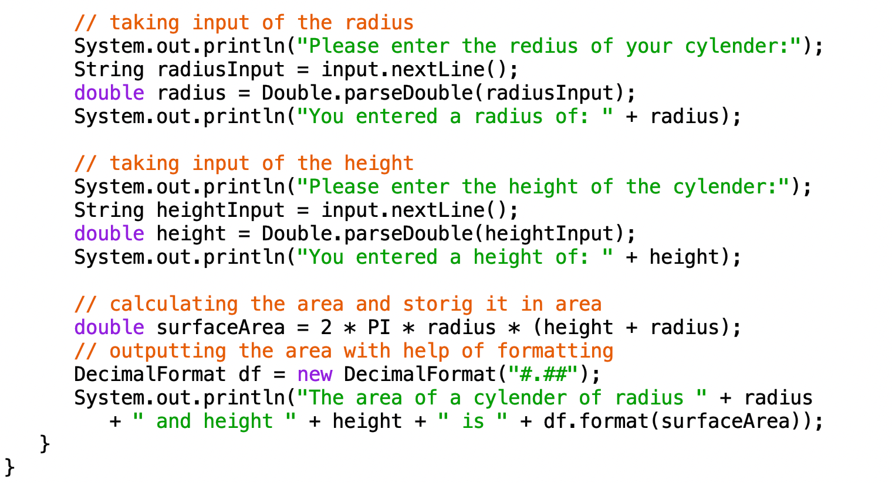

## About the Project:
This is a small program I wrote a long time ago that calculates how big the surface of a cylinder is. You just tell it the cylinder's height and how wide it is around the middle, and it figures out the surface area. This project was about using math in a computer program to solve a real-world problem.

## My Role:
I finished this small program by myself. I wrote the code that asks the user for the cylinder's size, did the math to find the surface area, and then made sure the program shows the answer nicely. My job was to make sure the program works correctly and is easy for people to use.

## What I Learned:
From this project, I learned how to write a program that uses math to answer a question. I got better at writing Java code, especially making the program talk to the user and give back the right answers. This was a great way for me to practice turning a math formula into a useful tool on the computer.

## The following is the output of this program：
Please enter the redius of your cylender:
7

You entered a radius of: 7.0

Please enter the height of the cylender:
3

You entered a height of: 3.0

The area of a cylender of radius 7.0 and height 3.0 is 439.82
